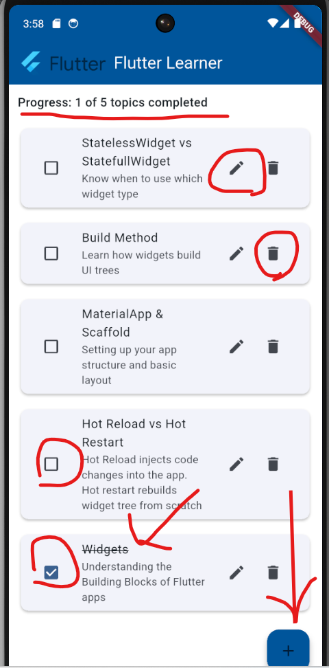
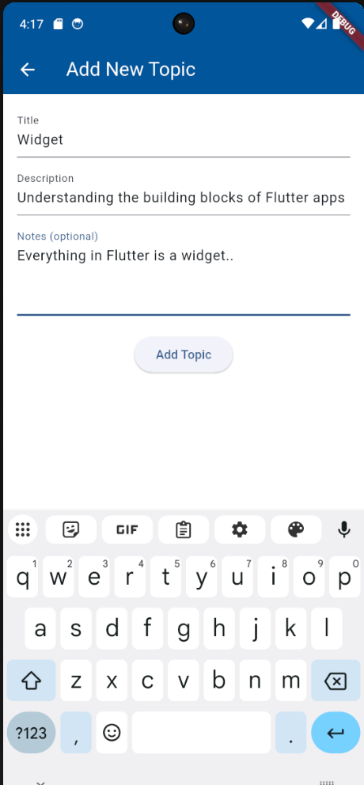
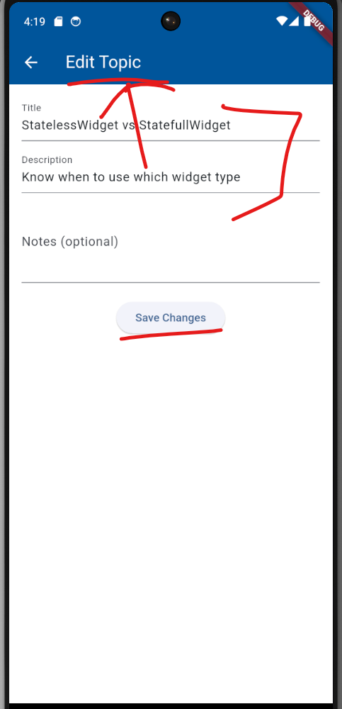
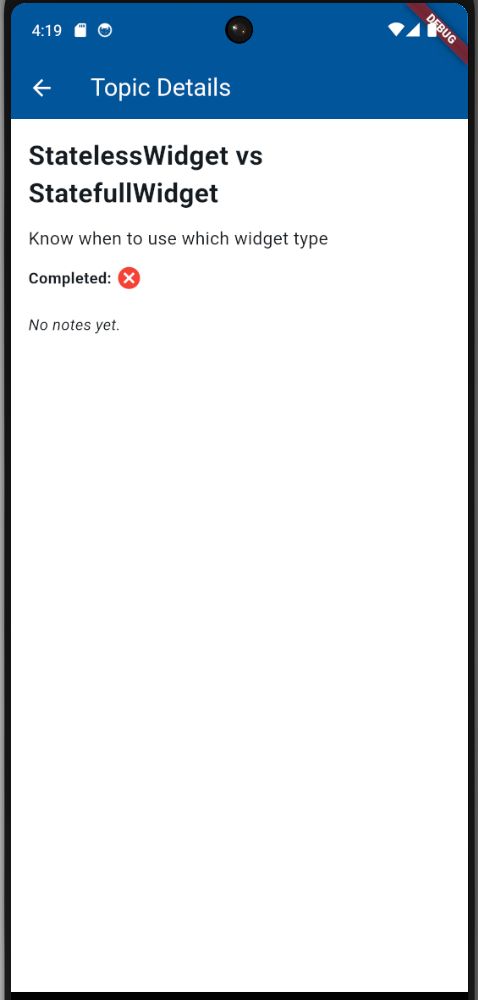
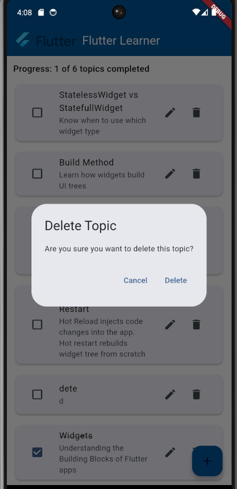
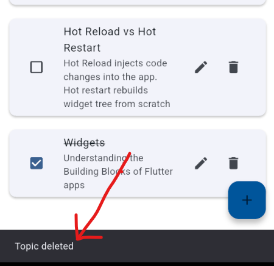

# 📱 Flutter Learner

**Flutter Learner** is a clean and simple mobile app built with Flutter that helps you track your learning progress as you study key Flutter concepts. It demonstrates full CRUD operations, proper state management using Provider, and local data persistence with SQLite. Built as part of a junior developer technical assessment.

---

## ✨ Features

- ✅ Add, edit, and delete Flutter learning topics
- ✅ Mark topics as complete/incomplete
- ✅ Include notes for each topic
- ✅ View details for each topic
- ✅ Smooth local storage using SQLite (`sqflite`)
- ✅ Modern UI with responsive layout, cards, and icons
- ✅ State management via `Provider`
- ✅ Works on Android emulator or real device

---

## 📸 Screenshots

Here are some screenshots demonstrating the features of **Flutter Learner**:

### 🏠 Home Screen
Displays a list of topics the user is learning. Users can mark topics as completed, edit, or delete them.



---

### ➕ Add Topic
Users can add a new topic, including a title, description, and optional notes.



---

### ✏️ Edit Topic
The same form is reused for editing. The UI updates to reflect that the user is modifying an existing topic.



---

### 📋 Topic Details
Users can tap on a topic to view its full details, including long notes and completion status.



---

### ❗ Delete Confirmation Prompt
When attempting to delete a topic, the app prompts for confirmation to prevent accidental deletions.



---

### ✅ Snackbar Feedback
After confirming deletion, editing, and adding a topic, a snackbar message appears as confirmation.




---

## 🛠 Tech Stack

- **Flutter** (Dart)
- **Provider** – State management
- **Sqflite** – SQLite persistence
- **Path Provider** – For DB file location
- **Material Design** – Default styling
- Tested on: **Android Emulator - API 34 (x86_64)**

---

## 🚀 Getting Started

### Prerequisites

- [Flutter SDK](https://flutter.dev/docs/get-started/install)
- Android Studio (for emulator + SDK)
- Git

### 1. Clone this repository

```bash
git clone https://github.com/DarraghReid/flutter_learner.git
cd flutter_learner
```

### 2. Install dependencies

```bash
flutter pub get
```

### 3. Run the app

Start your Android emulator, then:

```bash
flutter run
```

---

## 📁 Project Structure

```
lib/
├── db/
│   └── database_helper.dart       # Handles SQLite operations
├── models/
│   └── topic.dart                 # Topic data model
├── providers/
│   └── topic_provider.dart        # App state with Provider
├── screens/
│   ├── home_screen.dart           # Main topic list
│   ├── add_topic_screen.dart      # Form to add/edit topics
│   └── topic_detail_screen.dart   # View topic details
├── main.dart                      # App entry point
assets/
└── flutter_logo.png               # Branding image
```

---

## ⚙️ Developer Notes

- Database used: **SQLite**, stored locally
- Topics are displayed in order: **incomplete first**
- Progress tracker shows how many topics are complete
- All state is managed using **ChangeNotifier + Provider**

---

## 📌 Assumptions

- This project is evaluated on **Android**
- No backend or internet is needed
- App works entirely offline with persistent local data

---

## 🙌 Acknowledgements

Built for a junior Flutter developer technical assessment  
by [Darragh Reid](https://github.com/DarraghReid)

Thanks for taking the time to review my work!
